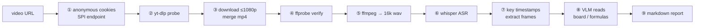

# bilibili-video-report

**Primary environment: [Hermes Agent](https://github.com/NousResearch/hermes-agent)** — this repo was developed and end-to-end verified inside a Hermes session. The skill itself follows the **Agent Skills open standard** (`SKILL.md` + YAML frontmatter), so Claude Code, Codex, OpenCode, Cursor, Gemini CLI and others can load it as-is; the four scripts also run **standalone, with no agent at all**. See [Environments](#environments) and [Invocation](#invocation).

> Turn a **Bilibili (B站)** video into an illustrated markdown report: key-frame screenshots, LaTeX formulas, and a topic-by-topic structure. A [Hermes Agent](https://github.com/NousResearch/hermes-agent) skill — but the scripts work standalone too.

[](LICENSE)
[](https://www.python.org/)

One URL in, one report out: **anonymous cookie (beats the 412 bot wall) → yt-dlp download → ffprobe verify → whisper ASR → key-frame extraction → VLM reads the board/formulas → markdown report.**

The four helper scripts use **only the Python standard library** (zero `pip install`s).

---

## Why this exists

1. **Bilibili's HTTP 412 is a cookie problem, not a header problem.** Adding `Referer` + a Chrome `User-Agent` is the advice everywhere, and it *still* returns 412. Bilibili's WAF also checks the anonymous `buvid3` / `buvid4` fingerprint cookies. This repo fetches them from Bilibili's own SPI endpoint (`api.bilibili.com/x/frontend/finger/spi` — **GET**; POST returns 405) and hands yt-dlp a Netscape cookie file. **No login, no account, no credentials.**
2. **Watching a 2-hour video is expensive; a timestamped transcript is not.** whisper transcribes the audio, you pick the topic boundaries, frames are grabbed there, and a VLM reads the blackboard/formulas — the result is searchable study notes instead of a video you'll never rewatch.
3. **Your chat model's "vision" may be fake.** Many models (DeepSeek, for instance) return **empty content** for `image_url` parts — it looks like the image was read when nothing happened. Frame reading therefore goes through a dedicated VLM call (`bili_vision.py`), swappable to any OpenAI-compatible endpoint.

---

## Pipeline



---

## Environments

| Environment | Where it lives | Auto-invoked? | Use it for |
|---|---|---|---|
| **Hermes Agent** (primary, verified) | `<hermes>/skills/media/` or `<hermes>/profiles/<name>/skills/media/` | ✅ matches on `description`; `-s` preloads it | one natural-language instruction runs the whole pipeline and delivers the report into the chat |
| **Other Agent Skills hosts** — Claude Code, Codex, OpenCode, Cursor, Cline, Gemini CLI, Copilot, claude.ai | `~/.claude/skills/`, `~/.agents/skills/`, … (see [Install](#install)) | ✅ same `SKILL.md` standard | you already live in another agent |
| **No agent** — plain CLI, your own Python, CI | nothing to install, just `git clone` | — | batch jobs, cron, embedding in an existing pipeline |

**Why Hermes is the primary environment:** this is not a blob of prose — it leans on concrete Hermes capabilities, and every number in this README was produced there (Windows 11 + a Hermes profile + Python 3.13.3 + whisper `large-v3-turbo` + `qwen3.7-plus` vision):

- **automatic skill loading** — a `description` match injects `SKILL.md`; no prompt to paste each time;
- **full tool access** — `terminal` (yt-dlp / ffmpeg / whisper), `execute_code` (batch frame reading, cache management, timeline maths), `MEDIA:` (hands the report plus `frames/` straight to the chat window);
- **multi-profile reuse** — `install.sh --all` puts it in every Hermes profile at once;
- **verifiable steps** — probe / ffprobe / cache files give every stage its own check.

On other hosts, the first two are provided by that host's own machinery (auto-load + terminal/file tools) and **the commands and steps in `SKILL.md` apply unchanged**.

---

## Requirements

| Component | Tested version | Required | Install |
|---|---|---|---|
| Python | 3.13.3 (≥3.9 works) | ✅ | [python.org](https://www.python.org/downloads/) |
| yt-dlp | 2026.08.19 | ✅ | `pip install -U yt-dlp` |
| ffmpeg + ffprobe | 8.0 | ✅ | `winget install Gyan.FFmpeg` / `brew install ffmpeg` / `apt install ffmpeg` |
| openai-whisper | latest | ✅ (ASR) | `pip install -U openai-whisper` |
| torch + CUDA | 2.7 | ⭕ optional (CPU works, 5–10× slower) | `pip install torch --index-url https://download.pytorch.org/whl/cu124` |
| vision API key | DashScope `qwen3.7-plus` | ✅ (frame reading) | see Configuration |

```bash
python scripts/check_env.py     # prints OK / WARN / MISSING for every dependency
```

---

## Install

### Hermes Agent (primary)

```bash
git clone https://github.com/mofahqc/bilibili-video-report.git
cd bilibili-video-report

./install.sh              # shared tree: <hermes>/skills/media/
./install.sh learning     # one profile: <hermes>/profiles/learning/skills/media/
./install.sh --all        # shared tree + every profile
```

Or let Hermes fetch it from GitHub — **works, but not recommended** (measured):

- Blocked by the skill scanner by default (`Installation blocked: community source + caution verdict`):
  it trips `python_subprocess` / `python_os_environ` / `unpinned_pip_install`, which is *inherent* to this
  skill — it shells out to ffmpeg/yt-dlp/whisper and reads the vision API key from the environment. `--force` is required.
- It installs under the frontmatter `name` (**`--name` had no effect in testing**) and will **silently overwrite**
  an existing skill of that name.
- Installing from a **single `SKILL.md` URL** fetched only part of `scripts/` in testing (2 of 4 files) and
  rewrote `SKILL.md`'s line endings.

```bash
# only if you insist, after reading the source yourself
hermes skills install https://raw.githubusercontent.com/mofahqc/bilibili-video-report/main/SKILL.md --force
```

**Prefer clone + `install.sh`** (option below): all four scripts land, byte-identical to the repo.

`%LOCALAPPDATA%\hermes` is detected automatically on Windows, and a `HERMES_HOME` that points at a *profile* dir is resolved up to the Hermes root.

### Other Agent Skills hosts

```bash
./install.sh --agent claude-code      # ~/.claude/skills/
./install.sh --agent codex            # ~/.agents/skills/
./install.sh --agent opencode         # ~/.config/opencode/skills/
./install.sh --agent gemini-cli       # ~/.gemini/skills/
./install.sh --agent agents           # ~/.agents/skills/  (universal / user scope)

./install.sh --agent claude-code --project /path/to/your/repo
# → <repo>/.claude/skills/… and <repo>/.agents/skills/…
```

Manual install = drop the skill folder at one of these paths (the folder name must equal `name`):

| Host | User / global | Project |
|---|---|---|
| **Hermes** | `<hermes>/skills/media/` | — |
| **Claude Code** | `~/.claude/skills/<name>/SKILL.md` | `<repo>/.claude/skills/<name>/SKILL.md` |
| **Codex CLI / IDE** | `$HOME/.agents/skills/<name>/` (some builds also scan `~/.codex/skills/`) | `<repo>/.agents/skills/<name>/` |
| **OpenCode** | `~/.config/opencode/skills/`, `~/.claude/skills/`, `~/.agents/skills/` | `.opencode/skills/`, `.claude/skills/`, `.agents/skills/` |
| **Gemini CLI** | `~/.gemini/skills/<name>/` | `<repo>/.agents/skills/<name>/` |
| **Cursor / Cline / Amp / GitHub Copilot** | — | `<repo>/.agents/skills/<name>/` |
| **claude.ai (web)** | upload a ZIP of the skill folder: Settings → Capabilities → Customize → Skills | — |

> Paths and frontmatter rules follow each host's own docs (Claude Code: `docs.anthropic.com/en/docs/claude-code/skills`; Codex: `developers.openai.com/codex/skills`; OpenCode: `opencode.ai/docs/skills`). This skill uses only the standard `name` / `description` fields and its folder name matches `name`, so all of the above accept it.

### No install at all

The four scripts are plain CLIs — `git clone` and run them.

---

## Invocation

### Hermes Agent (primary)

```
Analyze this Bilibili video and produce an illustrated report:
https://www.bilibili.com/video/BV1ezYx6EEqA
```

From the CLI / in automation:

```bash
hermes chat -q "Analyze this Bilibili video into an illustrated report: <URL>"
hermes -p kaoyan-math chat -q "Analyze this video: <URL>"          # a specific profile
hermes chat -s bilibili-video-report -q "Analyze this video: <URL>" # preload explicitly
```

Hermes follows the nine steps in `SKILL.md` and delivers the report with `MEDIA:`.

### Other Agent Skills hosts

| Host | How to trigger explicitly |
|---|---|
| Claude Code | type `/bilibili-video-report` (the skill name is the slash command), or just describe the task |
| Codex CLI / IDE | type `$bilibili-video-report`, or pick it from `/skills` |
| OpenCode | the agent loads it through its `skill` tool: `skill({ name: "bilibili-video-report" })` |
| Cursor / Cline / Copilot (`.agents/skills/`) | describe the task in chat; the host matches on `description` |
| claude.ai | enable it under Customize → Skills, then just ask |

**Requirement:** the host must be able to **run commands** (yt-dlp / ffmpeg / whisper) and **read/write files**. Without a terminal, this skill degrades to a prompt template — every step is a real command.

### No agent: CLI, Python, CI

Treat `SKILL.md` as a runbook, or call the scripts from your own Python:

```python
import subprocess, sys

SKILL = "/path/to/bilibili-video-report"
subprocess.run([sys.executable, f"{SKILL}/scripts/fetch_bili_cookies.py", "."], check=True)
timeline = subprocess.run([sys.executable, f"{SKILL}/scripts/bili_transcribe.py", "video.mp4"],
                          check=True, capture_output=True, text=True).stdout
subprocess.run([sys.executable, f"{SKILL}/scripts/bili_vision.py", "frames"], check=True)
```

In cron / GitHub Actions, inject the vision key as `DASHSCOPE_API_KEY` and run `check_env.py` as the first gate.

---

## Usage

Hand it to an agent:

```
Analyze this Bilibili video and produce an illustrated report:
https://www.bilibili.com/video/BV1ezYx6EEqA
```

Or drive the steps yourself:

```bash
mkdir -p /tmp/bili_job && cd /tmp/bili_job

# ① anonymous cookies (→ ./cookies.txt, valid ~1 year)
python <repo>/scripts/fetch_bili_cookies.py .

# ② probe before committing bandwidth
yt-dlp --cookies cookies.txt --add-header "Referer:https://www.bilibili.com" \
  --skip-download --print "%(title)s|%(duration)s|%(uploader)s" "URL"

# ③ download + merge
yt-dlp --cookies cookies.txt --add-header "Referer:https://www.bilibili.com" \
  -f "bv*[height<=1080]+ba/b[height<=1080]" --merge-output-format mp4 \
  -o "video.%(ext)s" "URL"

# ④ verify (catches video-only / truncated pulls)
ffprobe -v error -show_entries format=duration -show_entries stream=codec_name,width,height \
  -of default=noprint_wrappers=1 video.mp4

# ⑤⑥ transcribe
python <repo>/scripts/bili_transcribe.py video.mp4

# ⑦ frames at key timestamps
mkdir -p frames
ffmpeg -y -loglevel error -ss 150 -i video.mp4 -frames:v 1 -q:v 2 frames/f150.jpg

# ⑧ read the frames (cached per frame in vision_results.json)
python <repo>/scripts/bili_vision.py frames
```

⑨ Assemble the report using the template in `SKILL.md`, copy `frames/` next to the `.md`, and keep image links relative.

**Swapping the vision model:**

```bash
python scripts/bili_vision.py frames \
  --api-base https://api.openai.com/v1/chat/completions \
  --model gpt-4o-mini --api-key-env OPENAI_API_KEY
```

---

## Scripts

| Script | Purpose | Key flags |
|---|---|---|
| `fetch_bili_cookies.py <dir>` | Anonymous `buvid3`/`buvid4` → `cookies.txt` (the 412 fix) | — |
| `bili_transcribe.py <video>` | 16k mono wav + whisper JSON timeline | `--model --lang --outdir --keep-pythonpath` |
| `bili_vision.py <frames_dir>` | VLM frame reading, cached per frame | `--model --api-base --api-key-env --frames --prompt-file --max-tokens` |
| `check_env.py` | Dependency / model / API-key doctor | `--json` |

Environment variables: `WHISPER_EXE` (whisper not on PATH), `DASHSCOPE_API_KEY` / `ALIBABA_CODING_PLAN_API_KEY` (vision key), `HERMES_HOME`.

---

## Verified run

| Step | Result |
|---|---|
| Test video | `BV1ezYx6EEqA`, 164.6 s, 1440×1080 AV1 + AAC |
| Probe | `…｜164.568｜毕的二阶导｜100026+30280` — no 412 |
| Download | 11.9 MB merged `video.mp4` |
| ffprobe | duration 164.566625, video + audio streams present |
| ASR | 80 segments, **27 s** on GPU |
| Frames + VLM | 4/4 frames; read `$p<0.05$`, `$R^2=0.51$`, `$Q_{max}$`, $L_{max}/Q_{max}$ off a paper figure |

---

## Troubleshooting (short version)

| Symptom | Fix |
|---|---|
| `Installation blocked ... community source + caution verdict` on `hermes skills install` | The skill scanner sees shell-outs + env-var reads; use `git clone` + `./install.sh` (recommended) or review the code and add `--force` |
| After a raw `SKILL.md` URL install, `scripts/` is missing files and the skill fails | Single-file install fetched only part of `scripts/`; reinstall with `git clone` + `./install.sh` (or `install.sh --all`) |
| `HTTP Error 412` | You skipped the cookies: run `fetch_bili_cookies.py` and pass `--cookies` |
| `--cookies-from-browser` fails to decrypt | Don't use it — Edge/chrome cookie stores are locked/DPAPI-encrypted; use the anonymous SPI cookies |
| Download left a `.m4a.part` and no `video.mp4` | Re-run with `--continue --merge-output-format mp4`; don't re-download |
| whisper `ImportError` / `typing_extensions` clash | A foreign `PYTHONPATH` leaked in — the script strips it (use `--keep-pythonpath` to opt out) |
| VLM returns empty text | The model has no vision; point `--api-base/--model` at a real VLM |
| Report images broken | Use relative `frames/xx.jpg` links and ship the `frames/` folder |

Full write-up: [`docs/troubleshooting.md`](docs/troubleshooting.md).

---

## Copyright & third-party notices

- **This project's code** — MIT, © 2026 mofahqc (see [LICENSE](LICENSE)).
- **No third-party works are distributed here** — no downloaded video/audio, no video frames, no model weights, no `ffmpeg`/`yt-dlp` binaries. `.gitignore` excludes them; they are fetched locally at run time.
- **Quotes in the example report** — the video's title, uploader and a few transcript lines are quoted briefly with attribution (copyright stays with the uploader). The English sentence and Figure 6 content in section 4 come from Wheeler APS, Morad S, Buchholz N, Knight MM (2012) *The Shape of the Urine Stream — From Biophysics to Diagnostics*, PLOS ONE 7(10): e47133 (`doi:10.1371/journal.pone.0047133`), published under **CC BY** — reuse permitted with attribution, which is given above.
- **Trademarks** — Bilibili/哔哩哔哩, Hermes Agent/Nous Research, DashScope/Alibaba/Qwen, OpenAI, Anthropic/Claude, Cursor and others belong to their respective owners. This project is **not affiliated with, sponsored or endorsed by** any of them — in particular it has **no connection to Bilibili**.
- **Your responsibility** — personal study/research only; comply with Bilibili's terms of service and local copyright law; do not redistribute downloaded content.

Full component and licence table, including the FFmpeg LGPL/GPL caveat: **[NOTICE.md](NOTICE.md)**.

---

## License

[MIT](LICENSE). Downloaded video is **not** redistributed; the example report keeps only text and formula excerpts. Please use this for personal study/research and respect Bilibili's terms and local copyright law.
