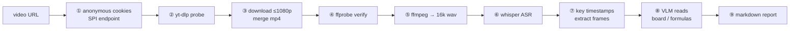

# bilibili-video-report

> Turn a **Bilibili (B站)** video into an illustrated markdown report: key-frame screenshots, LaTeX formulas, and a topic-by-topic structure. A [Hermes Agent](https://github.com/NousResearch/hermes-agent) skill — but the scripts work standalone too.

[](LICENSE)
[](https://www.python.org/)

One URL in, one report out: **anonymous cookie (beats the 412 bot wall) → yt-dlp download → ffprobe verify → whisper ASR → key-frame extraction → VLM reads the board/formulas → markdown report.**

The four helper scripts use **only the Python standard library** (zero `pip install`s).

---

## Why this exists

1. **Bilibili's HTTP 412 is a cookie problem, not a header problem.** Adding `Referer` + a Chrome `User-Agent` is the advice everywhere, and it *still* returns 412. Bilibili's WAF also checks the anonymous `buvid3` / `buvid4` fingerprint cookies. This repo fetches them from Bilibili's own SPI endpoint (`api.bilibili.com/x/frontend/finger/spi` — **GET**; POST returns 405) and hands yt-dlp a Netscape cookie file. **No login, no account, no credentials.**
2. **Watching a 2-hour video is expensive; a timestamped transcript is not.** whisper transcribes the audio, you pick the topic boundaries, frames are grabbed there, and a VLM reads the blackboard/formulas — the result is searchable study notes instead of a video you'll never rewatch.
3. **Your chat model's "vision" may be fake.** Many models (DeepSeek, for instance) return **empty content** for `image_url` parts — it looks like the image was read when nothing happened. Frame reading therefore goes through a dedicated VLM call (`bili_vision.py`), swappable to any OpenAI-compatible endpoint.

---

## Pipeline



---

## Requirements

| Component | Tested version | Required | Install |
|---|---|---|---|
| Python | 3.13.3 (≥3.9 works) | ✅ | [python.org](https://www.python.org/downloads/) |
| yt-dlp | 2026.08.19 | ✅ | `pip install -U yt-dlp` |
| ffmpeg + ffprobe | 8.0 | ✅ | `winget install Gyan.FFmpeg` / `brew install ffmpeg` / `apt install ffmpeg` |
| openai-whisper | latest | ✅ (ASR) | `pip install -U openai-whisper` |
| torch + CUDA | 2.7 | ⭕ optional (CPU works, 5–10× slower) | `pip install torch --index-url https://download.pytorch.org/whl/cu124` |
| vision API key | DashScope `qwen3.7-plus` | ✅ (frame reading) | see Configuration |

```bash
python scripts/check_env.py     # prints OK / WARN / MISSING for every dependency
```

---

## Install

```bash
git clone https://github.com/mofahqc/bilibili-video-report.git
cd bilibili-video-report

./install.sh              # default Hermes profile
./install.sh learning     # a named profile
./install.sh --all        # every profile on the machine
```

Or let Hermes install it straight from the raw `SKILL.md`:

```bash
hermes skills install https://raw.githubusercontent.com/mofahqc/bilibili-video-report/main/SKILL.md
```

No Hermes? Skip the install — the scripts are plain CLIs.

---

## Usage

Hand it to an agent:

```
Analyze this Bilibili video and produce an illustrated report:
https://www.bilibili.com/video/BV1ezYx6EEqA
```

Or drive the steps yourself:

```bash
mkdir -p /tmp/bili_job && cd /tmp/bili_job

# ① anonymous cookies (→ ./cookies.txt, valid ~1 year)
python <repo>/scripts/fetch_bili_cookies.py .

# ② probe before committing bandwidth
yt-dlp --cookies cookies.txt --add-header "Referer:https://www.bilibili.com" \
  --skip-download --print "%(title)s|%(duration)s|%(uploader)s" "URL"

# ③ download + merge
yt-dlp --cookies cookies.txt --add-header "Referer:https://www.bilibili.com" \
  -f "bv*[height<=1080]+ba/b[height<=1080]" --merge-output-format mp4 \
  -o "video.%(ext)s" "URL"

# ④ verify (catches video-only / truncated pulls)
ffprobe -v error -show_entries format=duration -show_entries stream=codec_name,width,height \
  -of default=noprint_wrappers=1 video.mp4

# ⑤⑥ transcribe
python <repo>/scripts/bili_transcribe.py video.mp4

# ⑦ frames at key timestamps
mkdir -p frames
ffmpeg -y -loglevel error -ss 150 -i video.mp4 -frames:v 1 -q:v 2 frames/f150.jpg

# ⑧ read the frames (cached per frame in vision_results.json)
python <repo>/scripts/bili_vision.py frames
```

⑨ Assemble the report using the template in `SKILL.md`, copy `frames/` next to the `.md`, and keep image links relative.

**Swapping the vision model:**

```bash
python scripts/bili_vision.py frames \
  --api-base https://api.openai.com/v1/chat/completions \
  --model gpt-4o-mini --api-key-env OPENAI_API_KEY
```

---

## Scripts

| Script | Purpose | Key flags |
|---|---|---|
| `fetch_bili_cookies.py <dir>` | Anonymous `buvid3`/`buvid4` → `cookies.txt` (the 412 fix) | — |
| `bili_transcribe.py <video>` | 16k mono wav + whisper JSON timeline | `--model --lang --outdir --keep-pythonpath` |
| `bili_vision.py <frames_dir>` | VLM frame reading, cached per frame | `--model --api-base --api-key-env --frames --prompt-file --max-tokens` |
| `check_env.py` | Dependency / model / API-key doctor | `--json` |

Environment variables: `WHISPER_EXE` (whisper not on PATH), `DASHSCOPE_API_KEY` / `ALIBABA_CODING_PLAN_API_KEY` (vision key), `HERMES_HOME`.

---

## Verified run

| Step | Result |
|---|---|
| Test video | `BV1ezYx6EEqA`, 164.6 s, 1440×1080 AV1 + AAC |
| Probe | `…｜164.568｜毕的二阶导｜100026+30280` — no 412 |
| Download | 11.9 MB merged `video.mp4` |
| ffprobe | duration 164.566625, video + audio streams present |
| ASR | 80 segments, **27 s** on GPU |
| Frames + VLM | 4/4 frames; read `$p<0.05$`, `$R^2=0.51$`, `$Q_{max}$`, $L_{max}/Q_{max}$ off a paper figure |

---

## Troubleshooting (short version)

| Symptom | Fix |
|---|---|
| `HTTP Error 412` | You skipped the cookies: run `fetch_bili_cookies.py` and pass `--cookies` |
| `--cookies-from-browser` fails to decrypt | Don't use it — Edge/chrome cookie stores are locked/DPAPI-encrypted; use the anonymous SPI cookies |
| Download left a `.m4a.part` and no `video.mp4` | Re-run with `--continue --merge-output-format mp4`; don't re-download |
| whisper `ImportError` / `typing_extensions` clash | A foreign `PYTHONPATH` leaked in — the script strips it (use `--keep-pythonpath` to opt out) |
| VLM returns empty text | The model has no vision; point `--api-base/--model` at a real VLM |
| Report images broken | Use relative `frames/xx.jpg` links and ship the `frames/` folder |

Full write-up: [`docs/troubleshooting.md`](docs/troubleshooting.md).

---

## License

[MIT](LICENSE). Downloaded video is **not** redistributed; the example report keeps only text and formula excerpts. Please use this for personal study/research and respect Bilibili's terms and local copyright law.
