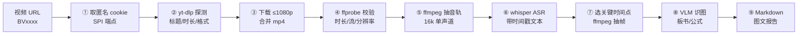

# bilibili-video-report

> 把 B站（Bilibili）视频变成**带关键帧截图、LaTeX 公式和结构目录的图文解析报告** —— 一个 [Hermes Agent](https://github.com/NousResearch/hermes-agent) 技能（skill）。

[](LICENSE)
[](https://www.python.org/)
[](#环境要求)
[](SKILL.md)

一个视频进去，一份报告出来：**取匿名 cookie 绕过 412 → yt-dlp 下载 → ffprobe 校验 → whisper 中文转写 → 抽关键帧 → 视觉模型读板书/公式 → 生成 Markdown 报告。**

辅助脚本**零第三方 Python 依赖**（纯标准库），所有外部工具通过命令行调用。

---

## 目录

- [它解决什么问题](#它解决什么问题)
- [特性](#特性)
- [流水线](#流水线)
- [目录结构](#目录结构)
- [环境要求](#环境要求)
- [安装](#安装)
- [快速开始](#快速开始)
- [脚本参考](#脚本参考)
- [报告格式](#报告格式)
- [配置与环境变量](#配置与环境变量)
- [疑难排查](#疑难排查)
- [实测记录](#实测记录)
- [FAQ](#faq)
- [与旧技能的关系](#与旧技能的关系)
- [许可证](#许可证)

---

## 它解决什么问题

三个真实存在的坎，本技能把它们固化成了可重复的流程：

**1. B站 HTTP 412（风控墙）——只改请求头是没用的。**
网上大多数方案让你加 `Referer` 和 Chrome 的 `User-Agent`，实测**依然 412**。B站的 WAF 还校验匿名指纹 cookie `buvid3` / `buvid4`。本技能从 B站自己的指纹端点 `api.bilibili.com/x/frontend/finger/spi` 取这两个 cookie（注意是 **GET**，POST 返回 405），写成一个 Netscape cookie 文件交给 yt-dlp。**不需要登录、不需要账号、不涉及任何凭据。**

**2. 长视频「看一遍」太贵，看完还记不住。**
whisper 先把整条语音转成带时间戳的文本，你（或 agent）从中挑出主题切换点，在那些位置抽帧，再让视觉模型读板书和公式 —— 得到的是**能检索、能复习的结构化笔记**，而不是两小时的视频。

**3. agent 自带的"视觉"可能是假的。**
很多主力对话模型（例如 DeepSeek）接到 `image_url` 会**返回空字符串**，看起来"看过图了"，其实什么都没看到。本技能把这个坑写死在流程里：识图必须走独立的视觉模型调用（脚本 `bili_vision.py`），任何 OpenAI 兼容的 VLM 都能替换。

---

## 特性

| | |
|---|---|
| 🔓 **绕过 412 风控** | 匿名指纹 cookie（`buvid3`/`buvid4`/`b_nut`/`b_lsid`），无需登录，cookie 有效期约 1 年，可缓存复用 |
| 🧠 **中文转写开箱可用** | 默认 `large-v3-turbo` + `--language zh`，164 秒音频实测 **27 秒**转完（CUDA） |
| 🖼 **板书/公式识别** | 抽帧 → 视觉模型输出 标题 / 全部公式（LaTeX）/ 要点文字 / 图形描述 |
| 🔁 **断点续跑** | cookie 复用、`yt-dlp --continue` 续传合并、**识图结果按帧缓存**（分多次调用不丢进度） |
| 🧩 **模型可替换** | `--api-base` / `--model` / `--api-key-env` 指向任何 OpenAI 兼容视觉端点（OpenAI、OpenRouter、本地 llama.cpp…） |
| 📦 **零 Python 依赖** | 4 个辅助脚本只用标准库（`urllib` / `base64` / `subprocess` / `json`），不需要 `pip install` 任何东西 |
| 🩺 **环境自检** | `python scripts/check_env.py` 逐项检查 yt-dlp / ffmpeg / whisper / 模型缓存 / API key，输出 OK / MISSING / WARN |
| 🧾 **结构化报告模板** | 视频信息 → 一句话总结 → 内容结构表 → 分主题（含截图+公式+讲解）→ 重点与易错提醒 |

---

## 流水线



每一步都有独立的校验或缓存：
- ② 是**廉价探测**，412 会在下载前暴露出来，不浪费带宽；
- ④ 抓"只有画面没有声音"或"下载被截断"；
- ⑥ 的 JSON 是唯一真源，报告里的时间轴全部来自它；
- ⑧ 的缓存文件 `vision_results.json` 让长视频可以分批识图。

---

## 目录结构

```
bilibili-video-report/
├── SKILL.md                     # 技能本体（Hermes / agents 读取的入口）
├── scripts/
│   ├── fetch_bili_cookies.py    # 取匿名 buvid cookie → cookies.txt（解决 412）
│   ├── bili_transcribe.py       # 视频 → 16k wav → whisper JSON 时间轴
│   ├── bili_vision.py           # 帧目录 → VLM 识图（带缓存、可换模型）
│   └── check_env.py             # 环境自检（依赖 / 模型 / API key）
├── examples/
│   └── example-report.md        # 一份真实跑出来的报告（结构示例）
├── docs/
│   └── troubleshooting.md       # 疑难排查详解
├── README.md                    # 中文详解（本文件）
├── README.en.md                 # English quickstart
├── requirements.txt             # 外部工具/Python 包依赖清单
├── install.sh                   # 安装到 Hermes 档案（单个或 --all）
├── LICENSE                      # MIT
└── .gitignore
```

---

## 环境要求

| 组件 | 实测版本 | 必需性 | 安装方式 |
|---|---|---|---|
| **Python** | 3.13.3（≥3.9 均可） | ✅ 必需 | [python.org](https://www.python.org/downloads/) |
| **yt-dlp** | 2026.08.19 | ✅ 必需 | `pip install -U yt-dlp` / `winget install yt-dlp` / `brew install yt-dlp` |
| **ffmpeg + ffprobe** | 8.0-essentials | ✅ 必需 | `winget install Gyan.FFmpeg` / `brew install ffmpeg` / `apt install ffmpeg`，或从 [gyan.dev](https://www.gyan.dev/ffmpeg/builds/) 解压后加入 PATH |
| **openai-whisper** | latest | ✅ 转写必需 | `pip install -U openai-whisper` |
| **torch** | 2.7 + CUDA | ⭕ 可选（CPU 也能跑，慢 5–10×） | `pip install torch --index-url https://download.pytorch.org/whl/cu124` |
| **视觉模型 API key** | DashScope `qwen3.7-plus` | ✅ 识图必需 | 见 [配置](#配置与环境变量) |

> 辅助脚本本身**不需要任何 Python 包**（纯标准库）。`requirements.txt` 列的是流水线要调用的外部工具。

**一行自检：**

```bash
python scripts/check_env.py
```

```
OK      python          3.13.3 (C:\...\Python313\python.exe)
OK      yt-dlp          2026.08.19
OK      ffmpeg          ffmpeg version 8.0-essentials_build-www.gyan.dev ...
OK      whisper         C:\...\Python313\Scripts\whisper.EXE
OK      whisper models  base.pt, large-v3-turbo.pt
OK      vision API key  sk-ws-...NBZ (from C:\...\hermes\profiles\learning\.env)
OK      helper scripts  fetch_bili_cookies.py, bili_transcribe.py, bili_vision.py

all required items present -- ready to run
```

缺什么它会直接告诉你，`MISSING` 会让脚本以退出码 1 结束（适合放进 CI / 安装脚本）。加 `--json` 输出机器可读结果。

---

## 安装

### 方式 A — 交给 Hermes Agent（推荐）

把这句话发给你的 Hermes：

```
把 https://github.com/mofahqc/bilibili-video-report 装成技能，然后分析这个视频：
https://www.bilibili.com/video/BVxxxxxxxxx
```

### 方式 B — 用 Hermes CLI 安装

```bash
# 直接指向仓库根目录的 SKILL.md
hermes skills install https://raw.githubusercontent.com/mofahqc/bilibili-video-report/main/SKILL.md
```

### 方式 C — 手动 clone + install.sh

```bash
git clone https://github.com/mofahqc/bilibili-video-report.git
cd bilibili-video-report

./install.sh              # 装到默认档案 (~/.hermes/skills/media/)
./install.sh learning     # 装到 profiles/learning
./install.sh --all        # 装到所有 Hermes 档案（自动跳过源目录本身）
```

脚本会把 `SKILL.md` 和 `scripts/` 复制到 `<hermes>/[profiles/<name>/]skills/media/bilibili-video-report/`，完成后打印目标路径。Windows 上 `LOCALAPPDATA\hermes` 会被自动识别。

> 不想装成技能也能用：4 个脚本是独立 CLI，`git clone` 后直接按下面的步骤运行即可。

---

## 快速开始

### 交给 agent 的用法

```
分析这个 B站视频，输出图文报告：https://www.bilibili.com/video/BV1ezYx6EEqA
```

agent 会读取 `SKILL.md`，按 9 步走完，最后给出报告文件（Markdown，图片为相对路径的 `frames/` 目录）。

### 手动命令行用法

```bash
# 准备一个工作目录（不要放在仓库/笔记库里，下载文件很大）
mkdir -p /tmp/bili_job && cd /tmp/bili_job

# ① 取匿名 cookie（写 ./cookies.txt，有效期约 1 年）
python <repo>/scripts/fetch_bili_cookies.py .
# wrote cookies.txt

# ② 探测（先确认可达，避免下载到一半才发现 412）
yt-dlp --cookies cookies.txt --add-header "Referer:https://www.bilibili.com" \
  --no-warnings --skip-download \
  --print "%(title)s|%(duration)s|%(uploader)s|%(format_id)s" \
  "https://www.bilibili.com/video/BV1ezYx6EEqA"
# 世界上一半的人每天看见这个现象，却不知道为什么|164.568|毕的二阶导|100026+30280

# ③ 下载最佳 ≤1080p 并合并为 mp4
yt-dlp --cookies cookies.txt --add-header "Referer:https://www.bilibili.com" \
  -f "bv*[height<=1080]+ba/b[height<=1080]" --merge-output-format mp4 \
  --sleep-requests 1 -o "video.%(ext)s" \
  "https://www.bilibili.com/video/BV1ezYx6EEqA"
# [Merger] Merging formats into "video.mp4"

# ④ 校验（必须做：能抓出"只有画面没有声音"和截断）
ffprobe -v error -show_entries format=duration,size \
  -show_entries stream=codec_name,width,height,channels -of default=noprint_wrappers=1 video.mp4
# codec_name=av1
# width=1440
# height=1080
# codec_name=aac
# channels=2
# duration=164.566625
# size=11949224

# ⑤⑥ 转写（抽音轨 + ASR，一次完成）
python <repo>/scripts/bili_transcribe.py video.mp4
# 0.00	1.22	拿着牛奶往外挤
# 1.22	4.02	牛奶竟然在空中扭成了一截一截的螺旋
# ...
# # 80 segments -> .../video.json

# ⑦ 在关键时间点抽帧（按时间命名，方便对回报告）
mkdir -p frames
ffmpeg -y -loglevel error -ss 150 -i video.mp4 -frames:v 1 -q:v 2 frames/f150.jpg

# ⑧ 识图（结果缓存进 vision_results.json，可分批重复运行）
python <repo>/scripts/bili_vision.py frames
# === f150.jpg ===
# 1) 画面标题：可以通过男性排尿时尿柱锁链的长度 ...
# 2) 所有公式：$p < 0.05$、$R^2 = 0.51$、$Q_{max}$、$L_{max}$ ...
# # 4/4 frames -> vision_results.json
```

⑨ 把上面的材料按 [报告格式](#报告格式) 组装成 Markdown，图片用相对路径 `frames/xx.jpg`，并在交付时把 `frames/` 一起带上。

---

## 脚本参考

### `fetch_bili_cookies.py`

```
python fetch_bili_cookies.py <out_dir>
```

| 参数 | 说明 |
|---|---|
| `<out_dir>` | 输出目录，生成 `<out_dir>/cookies.txt`（Netscape 格式） |

向 `https://api.bilibili.com/x/frontend/finger/spi` 发 **GET**（POST → 405），取 `b_3`/`b_4`，生成 `buvid3`、`buvid4`、`b_nut`、`b_lsid` 四个 cookie，有效期写 1 年。脚本自建 `ProxyHandler({})` opener，**绕过系统代理**，避免本地代理干扰。

### `bili_transcribe.py`

```
python bili_transcribe.py <video> [--model large-v3-turbo] [--lang zh]
                          [--outdir DIR] [--keep-pythonpath]
```

| 参数 | 默认 | 说明 |
|---|---|---|
| `--model` | `large-v3-turbo` | whisper 模型（`base` 更快更糙） |
| `--lang` | `zh` | 语言；中文必须显式指定，否则会猜错 |
| `--outdir` | 视频同目录 | 输出 `.wav` 与 `.json` 的位置 |
| `--keep-pythonpath` | 关 | 默认会从子进程环境里剥离 `PYTHONPATH`/`PYTHONHOME`，见下 |

找出 whisper：`$WHISPER_EXE` → PATH → 作者机器上的独立 Python 安装路径。stdout 每行 `开始<TAB>结束<TAB>文本`，stderr 给汇总。

> **为什么要剥离 `PYTHONPATH`：** agent 宿主的 shell 常常导出了另一个虚拟环境的 `site-packages`（Hermes 就会）。whisper 会因此 import 到不匹配的 `torch` / `typing_extensions` 而崩掉。普通环境下没影响；如果你的部署确实需要这些变量，加 `--keep-pythonpath`。

### `bili_vision.py`

```
python bili_vision.py <frames_dir> [--out vision_results.json] [--model qwen3.7-plus]
                      [--api-base URL] [--api-key-env NAME] [--prompt-file FILE]
                      [--frames 12,45,201] [--max-tokens 700] [--timeout 90]
```

| 参数 | 默认 | 说明 |
|---|---|---|
| `--model` | `qwen3.7-plus` | 任何 OpenAI 兼容视觉模型 |
| `--api-base` | DashScope `compatible-mode/v1/chat/completions` | 换端点即可换供应商 |
| `--api-key-env` | — | 优先从这个环境变量读 key |
| `--prompt-file` | 内置中文提示词 | 自定义提问（例如只提取公式） |
| `--frames` | 全部 | 只处理文件名含指定子串的帧，逗号分隔 |
| `--max-tokens` | `700` | 识别结果长度上限 |

- key 查找顺序：`$DASHSCOPE_API_KEY` → `$ALIBABA_CODING_PLAN_API_KEY` → `$HERMES_HOME/.env` → `~/.hermes/.env` → `$LOCALAPPDATA/hermes/.env` → `<hermes>/profiles/*/.env`
- **缓存**：结果存进 `vision_results.json`，键是帧文件名；已完成的帧会被跳过 —— **长视频分批多次调用不会重复计费**。
- 失败自动重试 1 次；有帧失败时只报错并继续，其余照常输出。

### `check_env.py`

```
python check_env.py [--json]
```

逐项检查 python / yt-dlp / ffmpeg / whisper / whisper 模型缓存 / 视觉 API key / 辅助脚本，输出 `OK` / `WARN` / `MISSING`；有 `MISSING` 时退出码为 1。API key 只显示掩码（`sk-ws-...NBZ`）。

---

## 报告格式

```markdown
# <视频标题> — 图文解析

> 来源: <URL> · UP主: <uploader> · 时长: <duration> · 生成日期: <date>

## 一句话总结
<一句话说清这个视频讲了什么>

## 内容结构
| # | 主题 | 时间 |
|---|---|---|
| 1 | … | 00:00–01:20 |
| 2 | … | 01:20–02:44 |

## 1. <主题>  `00:12`


- **讲解**：<把这段语音压成 2–3 句>
- **板书/公式**：$…$　（来自视觉模型的 LaTeX 输出）
- **怎么用 / 注意**：<可执行的结论>

## 重点 & 易错提醒
- …
```

完整示例见 [`examples/example-report.md`](examples/example-report.md)。

两个必须遵守的细节：
1. 图片用**相对路径** `frames/xx.jpg`，并把 `frames/` 目录和 `.md` 放在一起，否则链接全断；
2. 帧文件名用时间戳（`f150.jpg`），报告里的时间标签和图片链接就永远对得上。

---

## 配置与环境变量

| 变量 | 作用 | 默认 |
|---|---|---|
| `WHISPER_EXE` | whisper 可执行文件路径（当它不在 PATH 上时） | 自动探测 PATH，再回退到内置的 Windows 独立 Python 路径 |
| `DASHSCOPE_API_KEY` | 视觉模型 API key（首选名） | — |
| `ALIBABA_CODING_PLAN_API_KEY` | 视觉模型 API key（备选名，Hermes 的 `.env` 常用） | — |
| `HERMES_HOME` | Hermes 主目录，用于找到 `.env` | `~/.hermes`（Windows 上自动识别 `%LOCALAPPDATA%\hermes`） |

**换一个视觉模型**（示例：本地 OpenAI 兼容服务）

```bash
export VLM_KEY=sk-anything
python scripts/bili_vision.py frames \
  --api-base http://localhost:8080/v1/chat/completions \
  --model qwen2.5-vl-7b-instruct \
  --api-key-env VLM_KEY
```

---

## 疑难排查

| 现象 | 原因 | 解决 |
|---|---|---|
| `HTTP Error 412: Precondition Failed` | 只伪装了 `Referer`/`UA`，缺匿名指纹 cookie | 跑 `fetch_bili_cookies.py`，下载时加 `--cookies cookies.txt` |
| `--cookies-from-browser chrome` 报解密失败 | Edge 的 cookie 库 DPAPI 解密失败；Chrome 运行时数据库被锁 | 别用这个参数，用 SPI 匿名 cookie（不需要登录） |
| 下载中断，只剩 `video.f<id>.m4a.part` | yt-dlp 先下视频流、后下音频流，超时卡在音频 | 重跑加 `--continue --merge-output-format mp4` 只补音频并合并，**不要删了重下** |
| 1080P 高码率/4K 拿不到 | 高清需要登录态 | 匿名最高 ≤1080p，属预期行为 |
| whisper 报 `ImportError` / `typing_extensions` 冲突 | 宿主 shell 导出了别的 venv 的 `PYTHONPATH` | 脚本默认已剥离；若在别的环境里遇到，`unset PYTHONPATH` |
| 转写结果语言乱 / 中英混杂 | 没指定语言 | 必须 `--language zh`（脚本默认已带） |
| `--output_format` 报错 | whisper 只接受**单个**取值 | 用 `json` 或 `all`，不要逗号列表 |
| 识图返回**空字符串** | 用的模型不支持图片（如纯文本对话模型） | 换成真正的 VLM，走 `bili_vision.py` |
| 帧图片识别内容跑偏 | 抽帧时机落在转场/无板书画面 | 对着转写文本里的板书描述时间点重抽 |
| 报告里图片全部裂开 | 用了绝对路径或没把 `frames/` 一起交付 | 用相对路径并把 `frames/` 与 `.md` 放同级 |

更详细的排查笔记见 [`docs/troubleshooting.md`](docs/troubleshooting.md)。

---

## 实测记录

以下数据来自本仓库脚本的真实运行（Windows 11 + RTX GPU + Python 3.13.3 / whisper `large-v3-turbo` / qwen3.7-plus）：

| 环节 | 实测值 |
|---|---|
| 测试视频 | `BV1ezYx6EEqA`，164.6 秒，1440×1080 AV1 + AAC |
| 取 cookie | 成功（SPI GET，4 个 cookie） |
| 探测 | `世界上一半的人…｜164.568｜毕的二阶导｜100026+30280` |
| 下载合并 | 11.9 MB `video.mp4`，无 412 |
| ffprobe 校验 | 时长 164.566625，视频 + 音频双流 |
| ASR | 80 段中文时间轴，**27 秒**转完（GPU） |
| 抽帧 + 识图 | 4/4 帧成功；从论文插图正确读出 `$p<0.05$`、`$R^2=0.51$`、`$Q_{max}$`、$L_{max}/Q_{max}$ 等公式及坐标轴单位 |

---

## FAQ

**Q：需要 B站账号吗？会泄露什么吗？**
不需要。用的是 B站自己发给匿名访客的指纹 cookie（`buvid3`/`buvid4`），不含任何账号凭据。本仓库不收集、不上传任何数据，所有请求都是你的机器直连 B站。

**Q：能用于 B站以外的站点吗？**
可以。② ③ ④ ⑤ ⑥ ⑦ ⑧ 都是 yt-dlp/ffmpeg/whisper 的通用用法，只有 ①（cookie）是 B站专属。YouTube 等站点直接跳过 ① 并去掉 `--cookies` 参数即可。

**Q：一定要 GPU 吗？**
不必。CPU 也能跑 whisper，只是慢 5–10 倍；把 `--model` 换成 `base` 会明显加快。

**Q：识图必须用 DashScope 吗？**
不必。`bili_vision.py` 面向任何 OpenAI 兼容的 `/chat/completions` 视觉模型，见[配置](#配置与环境变量)。

**Q：这样下载视频合法吗？**
本仓库只提供技术流程。请仅用于个人学习/研究用途，并遵守 B站的服务条款与当地版权法规；**不要把下载的视频二次分发**。本仓库的示例报告只保留文字与公式摘录，不附带视频截帧。

---

## 与旧技能的关系

本仓库的内容由两份更窄的技能合并而成，并已端到端实测：

| 旧技能 | 现在 |
|---|---|
| `video-download`（只有下载 + 412 绕过） | 并入本技能的第 ①–③ 步 |
| `video-content-report`（只有 ASR + 识图 + 报告） | 并入本技能的第 ⑤–⑨ 步 |

如果你在别处装过这两个技能，它们的 `SKILL.md` 顶部会指向本技能作为规范入口。

---

## 许可证

[MIT](LICENSE)。随意使用、修改、分发，保留版权声明即可。

示例报告中的文本/公式摘录来自公开视频，仅用于说明输出格式；视频内容版权归原 UP 主所有。
